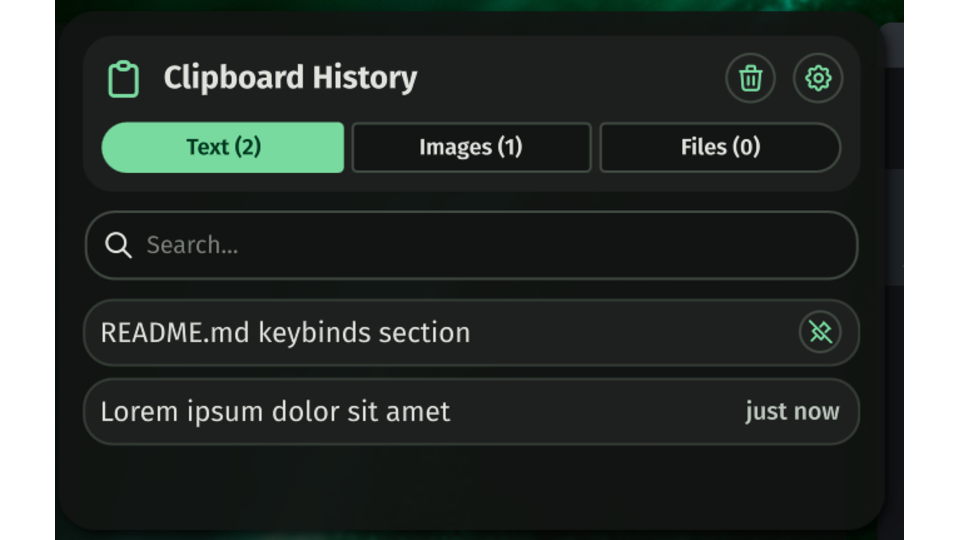

# Clipboard

A clipboard history panel for the [Noctalia](https://github.com/noctalia-dev/noctalia-shell) shell. Backed by [cliphist](https://github.com/sentriz/cliphist).



## Features

- **History panel** — searchable, scrollable clipboard history accessible from the status bar
- **Tabs** — switch between Text, Images, and Files views with keyboard shortcuts (1 / 2 / 3)
- **Search** — filter history in real time by content
- **Pinning** — pin entries to keep them at the top across sessions and reboots
- **Timestamps** — relative timestamps shown on every entry (e.g. "2 min ago")
- **Image previews** — inline thumbnails for image entries (toggleable)
- **Settings panel** — configure the plugin from Noctalia Settings without editing JSON
- **IPC commands** — `toggle` and `wipe` for compositor keybind integration

## Requirements

- Noctalia `4.1.2`+
- [cliphist](https://github.com/sentriz/cliphist)
- `wl-clipboard`

## Installation

Open **Noctalia Settings → Plugins**, search for **Clipboard**, and click Install.

## Development

To run a local checkout instead:

```bash
git clone https://github.com/yanekyuk/clipboard ~/.config/noctalia/plugins/clipboard
qs kill -c noctalia-shell; sleep 1; qs -d -c noctalia-shell
```

## Settings

Settings are stored in `~/.config/noctalia/plugins/clipboard/settings.json` (created on first load) and can be edited from **Noctalia Settings → Plugins → Clipboard**.

| Key | Default | Description |
|---|---|---|
| `maxHistorySize` | `100` | Maximum number of entries retained in history. |
| `showImagePreviews` | `true` | Show image thumbnails inline in the history panel. |
| `density` | `"comfortable"` | Visual density of the list. `"comfortable"` or `"compact"`. |

## IPC

| Command | Effect |
|---|---|
| `toggle` | Open/close the panel on the focused screen. |
| `wipe` | Clear history without opening the panel. |

```bash
qs -c noctalia-shell ipc call plugin:clipboard <command>
```

## Keybinds

### Niri

Add to `~/.config/niri/config.kdl` so the shell starts with your session:

```kdl
spawn-at-startup "qs" "-d" "-c" "noctalia-shell"
```

Add keybinds:

```kdl
binds {
    Mod+V { spawn "qs" "-c" "noctalia-shell" "ipc" "call" "plugin:clipboard" "toggle"; }
    Mod+Shift+V { spawn "qs" "-c" "noctalia-shell" "ipc" "call" "plugin:clipboard" "wipe"; }
}
```

### Hyprland

```ini
bindr = SUPER, V, exec, qs -c noctalia-shell ipc call plugin:clipboard toggle
bindr = SUPER SHIFT, V, exec, qs -c noctalia-shell ipc call plugin:clipboard wipe
```

### Sway / others

Any compositor that can run a shell command from a keybind works:

```bash
qs -c noctalia-shell ipc call plugin:clipboard toggle
```

## License

MIT.
